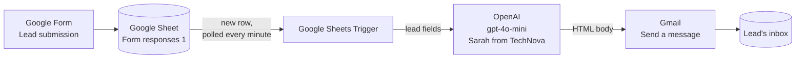
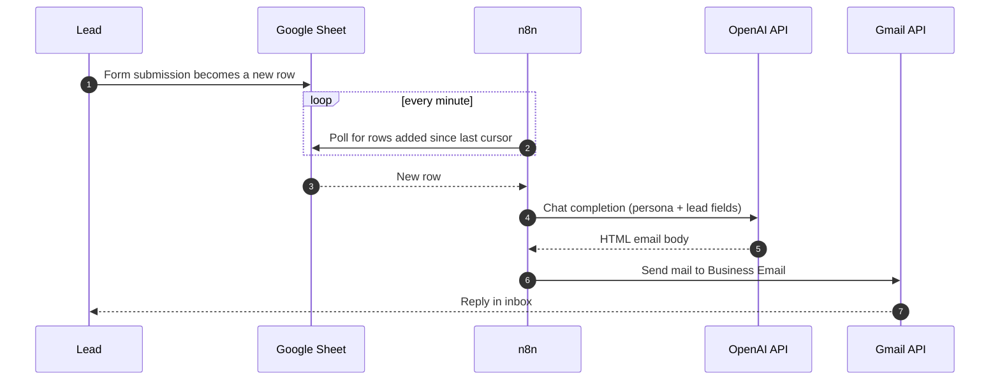

# Intelligent Client Inquiry Response System

> An n8n workflow that turns a Google Forms lead-capture sheet into personalized, brand-consistent email replies in under two minutes, with zero manual triage.

[](LICENSE)
[](.github/workflows/ci.yml)
[](https://github.com/ANI-IN/Intelligent-Client-Inquiry-Response-System/commits/main)
[](https://n8n.io)
[](https://platform.openai.com)
[](https://github.com/ANI-IN/Intelligent-Client-Inquiry-Response-System/issues)

## Hero

The **Intelligent Client Inquiry Response System** watches a Google Sheet that backs a marketing form, drafts a warm, personalized HTML email for every new lead using OpenAI's `gpt-4o-mini`, and sends that email through Gmail. It is a single n8n workflow with three nodes and no glue code. A small business or solo consultant can replace a manual "first reply within 24 hours" SLA with a "first reply within 2 minutes" one, without losing the human voice.

This repository contains the exported workflow JSON, a complete setup guide, an architecture document with diagrams, and the operational notes you need to run it safely.

## Table of contents

- [The problem](#the-problem)
- [The solution](#the-solution)
- [Who it is for and use cases](#who-it-is-for-and-use-cases)
- [Key features](#key-features)
- [Demo](#demo)
- [Architecture](#architecture)
- [Tech stack](#tech-stack)
- [Prerequisites](#prerequisites)
- [Installation](#installation)
- [Configuration](#configuration)
- [Running the workflow](#running-the-workflow)
- [Using it step by step](#using-it-step-by-step)
- [Workflow walkthrough](#workflow-walkthrough)
- [Sample data](#sample-data)
- [Customization](#customization)
- [Troubleshooting](#troubleshooting)
- [Project structure](#project-structure)
- [Security notes](#security-notes)
- [Contributing](#contributing)
- [License](#license)
- [Acknowledgments](#acknowledgments)

## The problem

Small consultancies, agencies, and solo operators live on inbound leads from short web forms. Every one of those leads is fragile:

- The first reply they get sets the tone. A slow, generic reply (or worse, the form-builder's autoresponder "Thanks for your submission") signals that nobody on the other side is paying attention.
- A founder or solutions lead is the right person to write that first reply, and is also the wrong person, because they are in a sales call or shipping a deliverable when the lead arrives. The reply slips by 4, then 24, then 48 hours.
- The lead's free-text field ("What is your biggest business challenge right now?") is exactly the input you want to respond to specifically. Reading it, understanding it, and replying in two or three coherent sentences takes ten minutes of focused thought per lead. Multiply by ten leads a week and you have lost a full workday on triage.

The opportunity cost is concrete: industry benchmarks consistently put the contact-to-qualified-meeting rate at roughly 21x higher when the first reply arrives within five minutes versus thirty minutes. If your replies arrive at twenty-four hours you are losing most of the value of running the form at all.

## The solution

This workflow closes the gap between submission and first reply. For every new row that lands in the Google Sheet behind your form, it:

1. Reads the lead's name, company, the service they expressed interest in, their email, and their free-text challenge.
2. Sends those fields into OpenAI's `gpt-4o-mini` with a persona prompt ("Sarah, the Senior Solutions Architect at TechNova Solutions") and a strict output template: greeting, acknowledgement, two sentences on the solution, a bolded call-to-action for a 15-minute discovery call, and a sign-off.
3. Sends the resulting HTML email through Gmail to the address on the form, with a subject line that echoes the service they asked about.

The persona, the template, and the sign-off are all in one file. You can change "Sarah from TechNova" to your own brand in two edits.

| Before                                                        | After                                                                                  |
| ------------------------------------------------------------- | -------------------------------------------------------------------------------------- |
| First reply in 24 hours, written from scratch each time       | First reply in under 2 minutes, drafted from a consistent persona                      |
| Quality varies with how rushed the responder is               | Tone is identical across every lead because the persona prompt is identical            |
| Easy to miss a lead that arrived overnight                    | The Google Sheets Trigger polls every minute, so nothing waits longer than a poll cycle |
| Hard to A/B test reply patterns                               | Change the prompt in one place to test a new tone or call-to-action                    |

It does not remove the human. It buys the human time. After the first automated reply the lead replies to a real inbox and a real person picks it up.

## Who it is for and use cases

This workflow is built for three kinds of people. All three look at the same JSON.

### Use case 1: the solo consultant

**Persona**: an independent strategy consultant who runs a Carrd or Webflow landing page with a contact form.
**Situation**: leads arrive at random times across timezones. The consultant cannot babysit the inbox.
**Outcome**: every lead receives a personalized two-paragraph reply with a discovery-call invitation within a poll cycle. The consultant then handles the actual meeting scheduling.

### Use case 2: the boutique agency

**Persona**: a five-person digital agency with a "request a quote" page.
**Situation**: the founder used to triage; the founder is now in delivery. The team needs a baseline reply that does not embarrass the brand.
**Outcome**: the workflow drafts the first reply in the agency's voice. The account manager reviews the executions tab once a day, escalates anything that needs a human eye, and lets the rest stand.

### Use case 3: the in-house growth team

**Persona**: a growth engineer at a small SaaS who needs to qualify inbound trial requests.
**Situation**: inbound requests need a sales-assist email and a calendar link, fast, but the SDR team is offshore and asleep when half the leads arrive.
**Outcome**: the workflow handles the EU and APAC overnight window. The SDR team picks up the conversation when they come online, with the lead already warm.

## Key features

User-facing:

- Personalized HTML reply per lead, addressed by name and tied to their stated service interest.
- Acknowledges the lead's free-text challenge so the reply does not read as boilerplate.
- Bolded call-to-action for a 15-minute discovery call this Thursday (you can change the day in one place).
- Subject line echoes the lead's service interest so the reply looks human-routed.
- Sign-off is a consistent persona, not a `[Your Name]` placeholder.

Technical:

- Three n8n core nodes. No community packages. No glue code.
- Polling-based trigger (no public webhook surface to defend).
- Credentials live in n8n's encrypted store, referenced by ID from the JSON.
- All configuration is inline and reviewable in a single JSON file under 150 lines.

Intentionally not included:

- No CRM write-back. You will want to add one (HubSpot, Pipedrive, or another Google Sheet) if you scale past a handful of leads per week.
- No conversation memory. Each run treats the lead as new.
- No A/B test framework. Change the prompt, observe the executions tab.
- No human-in-the-loop review queue. See [Security notes](#security-notes); this is intentional but worth a beat before going live.

## Demo

Below is the layout of the workflow as it appears in the n8n editor, plus a sample input row and the resulting email.

```text
+-----------------------+     +-----------------------+     +-----------------------+
|                       |     |                       |     |                       |
|  Google Sheets        | --> |  Message a model      | --> |  Send a message       |
|  Trigger              |     |  (OpenAI gpt-4o-mini) |     |  (Gmail)              |
|  every 1 min          |     |  Sarah from TechNova  |     |  To: lead's email     |
|                       |     |                       |     |                       |
+-----------------------+     +-----------------------+     +-----------------------+
```

**Sample input row** (one row in the linked Google Sheet):

| Full Name    | Company Name | Service Required          | What is your biggest business challenge right now? | Business Email          |
| ------------ | ------------ | ------------------------- | -------------------------------------------------- | ----------------------- |
| Priya Sharma | Northwind Co | Cloud cost optimization   | Our AWS bill doubled in six months and we cannot trace what is driving it. | priya@northwind.example |

**Sample output** (the body Gmail sends):

```html
Hi Priya,<br><br>
Thank you for reaching out about Cloud cost optimization at Northwind Co.<br><br>
Doubling AWS spend in six months almost always traces back to two or three workloads:
unbounded data egress and right-sizing drift. We start by mapping spend to product features
so you can decide where the cost is worth it and where it is not.<br><br>
I would love to walk you through how we approach this in a
<b>15-minute discovery call this Thursday</b>. Reply with a time that works and I will send
an invite.<br><br>
Best regards,<br>
Sarah from TechNova
```

**Subject line that arrives in the lead's inbox**: `Re: Your inquiry regarding Cloud cost optimization`.

## Architecture

The workflow is a three-node directed graph. See [docs/architecture.md](docs/architecture.md) for the full walkthrough with trust-boundary callouts. The two diagrams below are the high-level view.





## Tech stack

| Layer            | Tool                                                  | Why                                                                            |
| ---------------- | ----------------------------------------------------- | ------------------------------------------------------------------------------ |
| Orchestration    | [n8n](https://n8n.io)                                 | Visual workflow runner, hosts the three integrations natively                  |
| Lead source      | Google Forms + Google Sheets                          | Lowest-friction way to capture a structured lead                               |
| LLM              | OpenAI `gpt-4o-mini` via `@n8n/n8n-nodes-langchain.openAi` | Cheap, fast, follows formatting instructions well for short emails           |
| Email transport  | Gmail OAuth2                                          | Sends from a real Google identity so the email looks human                     |
| Storage          | n8n encrypted credential store                        | Holds Google + OpenAI tokens, encrypted with `N8N_ENCRYPTION_KEY`              |
| CI               | GitHub Actions                                        | Validates JSON parses and that no secret patterns are committed                |

## Prerequisites

You need accounts and access in three places. None of this requires a developer machine.

| Requirement                          | Detail                                                                                          |
| ------------------------------------ | ----------------------------------------------------------------------------------------------- |
| n8n                                  | Cloud account, or self-hosted v1.50 or later (tested on v1.50 and v1.62)                        |
| Google account                       | Owns the Form, the Sheet, and the Gmail sender identity. A Workspace account is recommended for higher sending limits |
| OpenAI account with a project API key | The default model is `gpt-4o-mini`. Budget roughly $0.001 to $0.003 per generated email          |
| Browser                              | Any modern browser to drive the n8n editor                                                       |
| Optional: Docker 24+ and Compose v2  | If you self-host n8n                                                                            |
| Optional: `jq`, `python` (any 3.x)   | If you want to validate the JSON locally before importing                                       |

## Installation

Pick one of two paths.

### Path A: n8n Cloud (no install)

1. Sign up at <https://n8n.io>.
2. In the editor, click **Workflows -> Add workflow -> import from file**, and pick `Intelligent Client Inquiry Response System.json` from this repo.
3. Continue to [Configuration](#configuration).

### Path B: self-host with Docker

```bash
git clone https://github.com/ANI-IN/Intelligent-Client-Inquiry-Response-System.git
cd Intelligent-Client-Inquiry-Response-System

# Create a working folder for n8n's data and config
mkdir -p ~/n8n-data && cd ~/n8n-data
cp /path/to/repo/.env.example .env

# Generate a strong encryption key and paste into .env as N8N_ENCRYPTION_KEY
openssl rand -hex 32

# Save the following docker-compose.yml in ~/n8n-data
cat > docker-compose.yml <<'YAML'
services:
  n8n:
    image: n8nio/n8n:latest
    restart: unless-stopped
    ports:
      - "5678:5678"
    env_file:
      - .env
    volumes:
      - ./data:/home/node/.n8n
YAML

docker compose up -d
open http://localhost:5678
```

Then import the workflow JSON via the n8n UI as in Path A.

## Configuration

### Environment variables (self-hosted only)

The workflow itself does not read `$env.X`, but the n8n runtime does. See [.env.example](.env.example) for the full list. The ones you must set:

| Variable                  | Default            | Sensitive | Purpose                                              |
| ------------------------- | ------------------ | --------- | ---------------------------------------------------- |
| `N8N_ENCRYPTION_KEY`      | none               | Yes       | Encrypts the credential store. Generate fresh.       |
| `N8N_HOST`                | `localhost`        | No        | Hostname the editor binds to                         |
| `N8N_PORT`                | `5678`             | No        | Port the editor binds to                             |
| `N8N_BASIC_AUTH_ACTIVE`   | `true`             | No        | Recommended for any reachable instance               |
| `N8N_BASIC_AUTH_USER`     | `admin`            | Yes       | Editor login                                         |
| `N8N_BASIC_AUTH_PASSWORD` | none               | Yes       | Editor password. Use a strong one.                   |
| `GENERIC_TIMEZONE`        | `UTC`              | No        | Time zone for any cron expressions                   |

### Knobs (where to tune the behavior)

| Knob                  | Default                                       | Where to change                                                                                        |
| --------------------- | --------------------------------------------- | ------------------------------------------------------------------------------------------------------ |
| Poll interval         | every minute                                  | Google Sheets Trigger node, **Poll Times**                                                             |
| Sheet to watch        | the demo sheet ID baked into the JSON         | Google Sheets Trigger node, **Document** field                                                         |
| Model                 | `gpt-4o-mini`                                 | Message a model node, **Model**                                                                        |
| Persona               | "Sarah, the Senior Solutions Architect at TechNova Solutions" | Message a model node, system message                                                  |
| Email template        | greeting / acknowledgement / two-sentence solution / bolded CTA / sign-off | Message a model node, user message                                              |
| Discovery-call day    | "this Thursday"                               | Message a model node, user message, the bolded phrase                                                  |
| Subject line          | `Re: Your inquiry regarding {Service Required}` | Send a message node, **Subject**                                                                     |
| Sender identity       | the Gmail account behind the Gmail OAuth credential | Configured outside the JSON, in n8n's credential store                                           |

## Running the workflow

After importing and configuring credentials (see [docs/getting-started.md](docs/getting-started.md) for the full step-by-step):

1. Open the workflow in the n8n editor.
2. Click **Execute Workflow** at the bottom of the canvas to do a one-shot run against any pinned data, or toggle **Active** in the top-right to start the polling loop.
3. Watch the **Executions** tab for each run. A green dot means the email was sent. A red dot means a node failed; click in to inspect.

The workflow is "running" the moment **Active** is on. There is no separate daemon to start.

## Using it step by step

End-to-end, from a fresh repo clone to a real email landing in your inbox:

1. **Clone this repo** and read [docs/getting-started.md](docs/getting-started.md).
2. **Spin up an n8n instance** (Cloud or Docker).
3. **Import** `Intelligent Client Inquiry Response System.json` from the repo root.
4. **Replace the document ID** in the Google Sheets Trigger node with your own sheet.
5. **Connect three credentials**: Google Sheets OAuth2, OpenAI API key, Gmail OAuth2.
6. **Confirm sheet columns** match the five names listed in [docs/getting-started.md, section 4](docs/getting-started.md#4-align-the-sheet-schema).
7. **Pin a test row** whose `Business Email` is your own address and run the workflow once manually.
8. **Open your inbox.** You should see the email within seconds.
9. **Toggle Active** on the workflow.
10. **Submit a real form response** and confirm the lead receives the email.

## Workflow walkthrough

The full JSON is `Intelligent Client Inquiry Response System.json`. Below is the node-by-node walkthrough referenced to the JSON's path expressions.

### Node 1: Google Sheets Trigger (`nodes[0]`)

- **Type / version**: `n8n-nodes-base.googleSheetsTrigger`, v1.
- **What it does**: polls the linked Google Sheet every minute and emits one execution per new row (`event: rowAdded`).
- **Key parameters**:
  - `pollTimes.item[0].mode = everyMinute`
  - `documentId` and `sheetName` reference the demo sheet by ID. Change these for your own sheet.
- **Credential**: `googleSheetsTriggerOAuth2Api` (display name "Google Sheets Trigger account 3").

### Node 2: Message a model (`nodes[1]`)

- **Type / version**: `@n8n/n8n-nodes-langchain.openAi`, v2.1.
- **What it does**: sends a two-message chat completion to `gpt-4o-mini`.
- **Key parameters**:
  - `modelId.value = "gpt-4o-mini"`.
  - `responses.values[0]` is the system message: defines persona "Sarah, the Senior Solutions Architect at TechNova Solutions", tone, and the rule against `[Your Name]` placeholders.
  - `responses.values[1]` is the user message: interpolates the five sheet fields into an instruction that requests a five-part HTML email and demands the output be raw HTML without code fences.
- **Output shape**: the workflow downstream reads `$json.output[0].content[0].text`.
- **Credential**: `openAiApi` (display name "OpenAi account 15").

### Node 3: Send a message (`nodes[2]`)

- **Type / version**: `n8n-nodes-base.gmail`, v2.2.
- **What it does**: sends one outbound email per execution.
- **Key parameters**:
  - `sendTo = {{ $('Google Sheets Trigger').item.json['Business Email'] }}` (reads from the original trigger output, not the LLM's pass-through).
  - `subject = "Re: Your inquiry regarding {{ Service Required }}"`.
  - `message = {{ $json.output[0].content[0].text }}` (the HTML body from the LLM).
- **Credential**: `gmailOAuth2` (display name "Gmail account 3").

### Connections

The `connections` block wires `Google Sheets Trigger -> Message a model -> Send a message`. There is no branching, no merge, no error handler. See [docs/architecture.md](docs/architecture.md) for the diagram.

## Sample data

The Google Sheet behind the workflow expects these columns by exact name (case sensitive):

| Column                                                | Type    | Example                                            |
| ----------------------------------------------------- | ------- | -------------------------------------------------- |
| `Full Name`                                           | string  | `Priya Sharma`                                     |
| `Company Name`                                        | string  | `Northwind Co`                                     |
| `Service Required`                                    | string  | `Cloud cost optimization`                          |
| `What is your biggest business challenge right now?`  | string  | `Our AWS bill doubled in six months.`              |
| `Business Email`                                      | string  | `priya@northwind.example`                          |

You can use this row as a smoke test. Paste it into your linked sheet (with your own email instead of `priya@northwind.example`), wait one minute, and the reply should arrive.

## Customization

Each row in the table below is a common change someone will want to make.

| You want to                                | Where to change it                                                                                              |
| ------------------------------------------ | --------------------------------------------------------------------------------------------------------------- |
| Change the persona name                    | System prompt at `nodes[1].parameters.responses.values[0].content`; also update the Gmail sender identity        |
| Change the company name                    | Same system prompt; the user prompt does not hard-code the company                                              |
| Switch the day for the discovery call      | User prompt at `nodes[1].parameters.responses.values[1].content`, search for `15-minute discovery call this Thursday` |
| Change the LLM model                       | `nodes[1].parameters.modelId.value`                                                                             |
| Slow the polling cadence                   | `nodes[0].parameters.pollTimes.item[0].mode` to `everyXMinutes` and set `value` to 5 or 10                       |
| Add a new field from the form              | Add a column to the sheet, then reference it in the user prompt with `{{ $json['Column Name'] }}`               |
| Send from a different sender               | Replace the `gmailOAuth2` credential in n8n with one bound to the new account                                   |
| Switch to plain text instead of HTML       | Rewrite the system prompt to demand plain text, then set the Gmail node's content type accordingly              |

## Troubleshooting

| Symptom                                                      | Likely cause                                                            | Fix                                                                                                                            |
| ------------------------------------------------------------ | ----------------------------------------------------------------------- | ------------------------------------------------------------------------------------------------------------------------------ |
| Trigger node says `Could not find the sheet`                 | The imported JSON points at the demo sheet ID, which you do not own     | Edit the Google Sheets Trigger node and pick **your** sheet from the **Document** dropdown                                     |
| Email body reads `Hi undefined,`                             | A sheet column was renamed; one of the five names no longer matches     | Restore the original column names in the sheet, or update the references in the user prompt                                    |
| Email body contains a literal ` ```html ` line               | The LLM ignored the "no code fences" instruction                        | Re-run; if persistent, add a Set node after the LLM that strips ` ```html ` and ` ``` ` (see finding TD-02 in the audit)        |
| Gmail node errors with `Recipient address required`          | The `Business Email` cell was blank for that row                        | Add an IF guard before Gmail; see finding REL-01 in the local improvement plan                                                 |
| OpenAI returns `429 Too Many Requests`                       | You hit your tier's per-minute rate limit                               | Reduce the trigger frequency, enable **Retry On Fail** on the LLM node, or upgrade your OpenAI plan                            |
| Trigger stops firing silently                                | OAuth refresh token revoked, or sheet permissions changed               | Open the credential in n8n and re-authorize                                                                                    |
| Two identical emails arrive for the same lead                | n8n restarted mid-execution; at-least-once delivery                     | Acceptable at low volume; for production, see finding REL-03 (add a "Replied At" idempotency column)                           |
| Workflow fails with `Cannot read properties of undefined (reading 'content')` | OpenAI returned an empty completion                       | Add **Retry On Fail** on the LLM node, and consider a fallback Set node that writes a placeholder reply when retries exhaust   |

## Project structure

```text
.
├── .editorconfig                                    LF, UTF-8, 2-space indent defaults
├── .env.example                                     Template for self-hosted n8n environment variables
├── .github/
│   ├── ISSUE_TEMPLATE/
│   │   ├── bug_report.md                            Bug-report form
│   │   └── feature_request.md                       Feature-request form
│   ├── PULL_REQUEST_TEMPLATE.md                     PR checklist
│   └── workflows/
│       └── ci.yml                                   Validates JSON parses, blocks committed secrets and em dashes
├── .gitignore                                       Ignores .env, n8n local data, credential exports, audit folder
├── CHANGELOG.md                                     Keep-a-Changelog log; starts at [Unreleased]
├── CODE_OF_CONDUCT.md                               Contributor-Covenant-derived
├── CONTRIBUTING.md                                  Manual review checklist for workflow JSON changes
├── Demo 3 _ n8n - Intelligent Client Inquiry Response System.docx   Original demo document
├── Intelligent Client Inquiry Response System.json  The workflow export. The only source of truth.
├── LICENSE                                          MIT
├── README.md                                        This file
├── SECURITY.md                                      Disclosure policy and known-risk areas
└── docs/
    ├── architecture.md                              Mermaid diagrams, node walkthrough, trust boundaries
    └── getting-started.md                           Setup walkthrough from zero
```

## Security notes

This automation sends real outbound email with no human review step. Before pointing it at production, read [SECURITY.md](SECURITY.md). The three points to internalize:

1. The lead's free-text field is forwarded to OpenAI and indirectly into your outbound email. A hostile lead can attempt prompt injection.
2. The Gmail node uses **Send**, not **Create Draft**. There is no undo.
3. Lead PII crosses your security perimeter to reach OpenAI. Make sure your privacy notice says so.

The full audit lives in `improvements/IMPROVEMENT_PLAN.md` (kept locally, not pushed to this repo). It contains ten ranked findings with concrete fixes.

## Contributing

Pull requests and issues are welcome. Read [CONTRIBUTING.md](CONTRIBUTING.md) first; it describes the manual review checklist for any change to the workflow JSON. Participation is governed by the [Code of Conduct](CODE_OF_CONDUCT.md).

## License

This project is released under the [MIT License](LICENSE). Copyright 2026 Animesh Kumar.

## Acknowledgments

- [n8n](https://n8n.io) for the workflow runtime that makes this kind of project a single JSON file.
- [OpenAI](https://platform.openai.com) for the `gpt-4o-mini` model that does the actual drafting.
- Google Workspace for the Forms, Sheets, and Gmail surfaces this workflow stitches together.
- Everyone who has written publicly about prompt injection and AI-assisted outbound email; the safety considerations in this README and in `improvements/IMPROVEMENT_PLAN.md` are downstream of that body of work.
