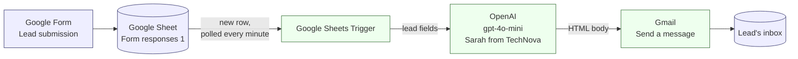
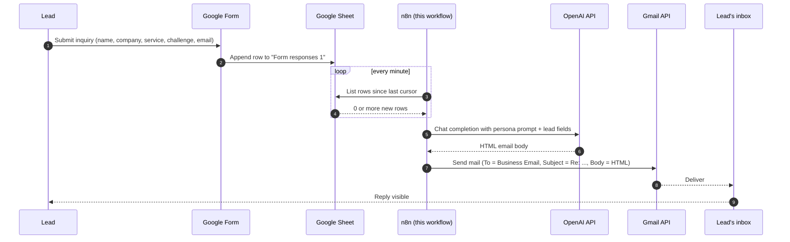
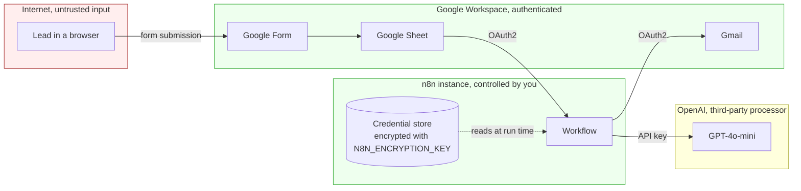

# Architecture

This document describes how the **Intelligent Client Inquiry Response System** is wired together inside n8n. It is the deeper companion to the [Architecture section of the README](../README.md#architecture).

The system is a single n8n workflow. It watches a Google Sheet that collects leads from a marketing form, drafts a personalized HTML reply with OpenAI, and sends that reply through Gmail. There are three nodes and one linear data path.

## High-level flowchart

The diagram mirrors the `connections` object in `Intelligent Client Inquiry Response System.json` one-for-one.

**Reading the diagram.** The blue boxes are systems outside n8n. The green boxes are nodes inside the workflow. The arrows are data dependencies, not API directions. The whole left-to-right path runs once per new row.

## Sequence diagram: one lead, end to end

This is what happens between a lead submitting the form and the lead receiving an email. Time flows downward.

**Latency budget.** The dominant terms are the polling interval (up to 60 seconds), the OpenAI response time (typically 1 to 4 seconds for `gpt-4o-mini`), and Gmail send time (sub-second). Wall-clock from submission to inbox is typically under two minutes.

## What lives where

Each row maps a concept to the exact location inside the workflow JSON.

| Concept                       | File                                                       | Location                                  |
| ----------------------------- | ---------------------------------------------------------- | ----------------------------------------- |
| Trigger node                  | `Intelligent Client Inquiry Response System.json`          | nodes[0], `Google Sheets Trigger`         |
| Source sheet (document ID)    | `Intelligent Client Inquiry Response System.json`          | nodes[0].parameters.documentId.value      |
| Source tab (gid)              | `Intelligent Client Inquiry Response System.json`          | nodes[0].parameters.sheetName.value       |
| Polling cadence               | `Intelligent Client Inquiry Response System.json`          | nodes[0].parameters.pollTimes.item[0]     |
| LLM model                     | `Intelligent Client Inquiry Response System.json`          | nodes[1].parameters.modelId.value         |
| System prompt (Sarah persona) | `Intelligent Client Inquiry Response System.json`          | nodes[1].parameters.responses.values[0]   |
| User prompt template          | `Intelligent Client Inquiry Response System.json`          | nodes[1].parameters.responses.values[1]   |
| Recipient address mapping     | `Intelligent Client Inquiry Response System.json`          | nodes[2].parameters.sendTo                |
| Subject template              | `Intelligent Client Inquiry Response System.json`          | nodes[2].parameters.subject               |
| Body wiring                   | `Intelligent Client Inquiry Response System.json`          | nodes[2].parameters.message               |
| Edge: Trigger -> LLM          | `Intelligent Client Inquiry Response System.json`          | connections["Google Sheets Trigger"]      |
| Edge: LLM -> Gmail            | `Intelligent Client Inquiry Response System.json`          | connections["Message a model"]            |
| Active flag                   | `Intelligent Client Inquiry Response System.json`          | top-level `active`                        |

## Node walkthrough

### Node 1: Google Sheets Trigger

- **Type**: `n8n-nodes-base.googleSheetsTrigger`, typeVersion 1.
- **What it does**: every minute, queries the Google Sheets API for rows that did not exist on the previous poll, and emits one workflow execution per new row.
- **Input columns it expects**: `Full Name`, `Company Name`, `Service Required`, `What is your biggest business challenge right now?`, `Business Email`.
- **Credential**: Google OAuth2, stored under the name "Google Sheets Trigger account 3" inside n8n.
- **Failure modes**:
  - Sheet renamed or deleted: trigger throws and the workflow is marked failed in the executions list.
  - Column header changed: downstream expressions resolve to `undefined`, the LLM produces a generic email.
  - OAuth refresh token revoked: trigger stops polling silently in older n8n versions, ask n8n for the credential status.

### Node 2: Message a model

- **Type**: `@n8n/n8n-nodes-langchain.openAi`, typeVersion 2.1.
- **What it does**: sends a chat completion to `gpt-4o-mini`. The system message defines the persona ("Sarah, the Senior Solutions Architect at TechNova Solutions"). The user message interpolates the lead's name, company, service interest, and free-text challenge into a structured email template, and demands HTML output without code fences.
- **Output shape**: an `output` array whose first element holds `content[0].text`. The downstream Gmail node reads exactly that path.
- **Failure modes**:
  - 401 Unauthorized: OpenAI key missing or revoked, replace the credential.
  - 429 Too Many Requests: rate-limited. Without a retry policy on this node, the row is dropped from this run; the trigger will not re-emit it.
  - The model returns markdown-fenced HTML despite the prompt: the fence ends up in the email body. Mitigated by `improvements/IMPROVEMENT_PLAN.md` finding **TD-02**.

### Node 3: Send a message (Gmail)

- **Type**: `n8n-nodes-base.gmail`, typeVersion 2.2.
- **What it does**: sends a single email. The recipient is taken from `Business Email` on the original sheet row (referenced through `$('Google Sheets Trigger').item.json['Business Email']`, which is the safe way to read the trigger's output after another node has run in between). The subject is templated against `Service Required`. The body is the raw HTML from the LLM.
- **Credential**: Gmail OAuth2, "Gmail account 3". The sender identity is whichever address that account represents.
- **Failure modes**:
  - Empty `Business Email`: Gmail API rejects with `400 invalid To header`. The workflow execution fails. No retry by default.
  - Gmail sending limits hit (about 500 messages per day for a consumer account, 2000 for Workspace): subsequent sends 403.
  - Body contains a link the lead's spam filter dislikes: delivered to spam, but the workflow reports success.

## Trust boundaries

The diagram below shows where untrusted data enters and where credentials live. Anything that crosses a boundary needs validation, encoding, or auth.

**Boundary 1: Lead to Form.** Anything a lead types in the form is untrusted. The `What is your biggest business challenge right now?` field is a free-text input that gets forwarded directly to the LLM and is therefore a prompt-injection vector. See **SEC-02** in the improvement plan.

**Boundary 2: n8n to OpenAI.** Lead PII crosses this boundary in cleartext (over TLS). Document this in your privacy policy if you operate under GDPR or similar.

**Boundary 3: n8n to Gmail.** The "From" address is whichever Google account the OAuth credential represents. The email leaves your domain looking like it came from a human.

## Invariants the design relies on

- **Sheet column names are stable.** The workflow reads columns by name. Renaming a column in the sheet without updating the workflow silently breaks the email body.
- **Polling is at-least-once, not exactly-once.** If n8n is restarted mid-execution, a row can in theory be processed twice. The current workflow has no idempotency guard. For a low-volume marketing form this is acceptable; for a billing workflow it would not be.
- **OpenAI returns deterministic-enough output.** The prompt asks for raw HTML with no code fences. The Gmail node trusts that. The system has no validator. If OpenAI's behavior drifts, emails get uglier without anything failing.
- **Gmail send is fire-and-forget.** There is no bounce handler, no read receipt, no DLQ. A 5xx from Gmail surfaces as an n8n execution error; a delivery failure after Gmail accepts the message is invisible.

## Pointers

- The full audit lives in `improvements/IMPROVEMENT_PLAN.md` (kept locally; not committed to the public repo).
- Setup steps live in [docs/getting-started.md](getting-started.md).
- Security policy lives in [../SECURITY.md](../SECURITY.md).
